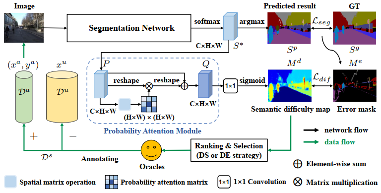
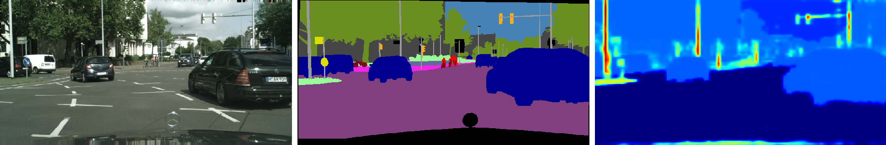
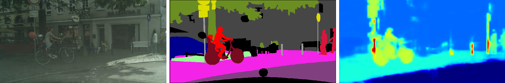
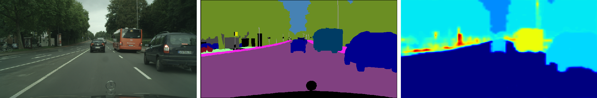
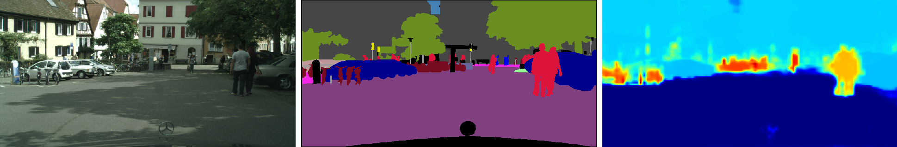
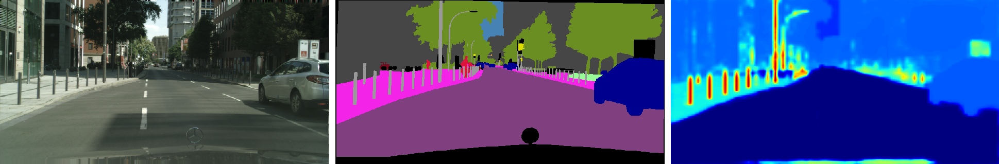
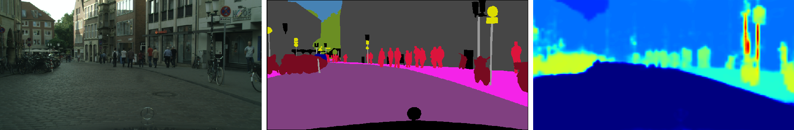
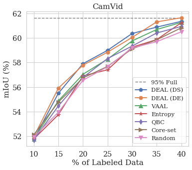
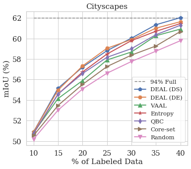

# DEAL 

In this work, we propose a semantic **Difficulty-awarE Active Learning (DEAL)** method taking the semantic difficulty into consideration.
To capture the semantic difficulty, we adopt a two-branch framework and utilize the wrong predicted result, which is termed as the **error mask**.
It's a binary image where the right and wrong positions have a value 0 and 1, respectively.
Then, a **pixel-wise probability attention module[2]** is introduced to **aggregate similar pixels into areas and learn the proportion of error pixels as the difficulty score for each area**. 
Finally, we can obtain the semantic difficulty map where the difficulty score for each area has a **close connection with the standard IoU metric**.

</img>

Overview of our difficulty-aware active learning framework for semantic segmentation. 
The first branch is a common semantic segmentation network.
The second branch is composed of a probability attention module and a 1×1 convolution.
<i><b>Da</b></i> and <i><b>Du</b></i> are the annotated and unlabeled data, 
<i><b>Ds</b></i> is a subset selected from <i><b>Du</b></i>.
<i><b>P</b></i> and <i><b>Q</b></i> are the probability maps before and after attention.
<i><b>Lseg</b></i> and <i><b>Ldif</b></i> are two loss functions. 
DS and DE are two acquisition funcions.

## Qualitative Results of Semantic Difficulty Map

Below are the qualitative results we get in Cityscapes.

It can be observed that objects with high difficulty scores have the following characters.
- **Slender or tiny objects**.
  - *poles* and *traffic signs* in the 1st and 5th rows; 
  - *bicycles* far away in the 4th row.
- **Under-represented classes**. 
  - In the 2nd row, *rider* has a higher score than *pedestrian*; 
  - In the 3rd row, *bus* has a higher score than *car*.

<table>
	<tr>
	    <th></th>
        <th width="33.3%">Image</th>
        <th width="33.3%">GT</th>
        <th width="33%">Semantic Difficulty Map</th>
	</tr>
	<tr>
	    <td>1</td>
	    <td style="padding: 0" colspan="3"></td>
	</tr>
	<tr>
	    <td>2</td>
	    <td style="padding: 0" colspan="3"></td>
	</tr>
	<tr>
	    <td>3</td>
	    <td style="padding: 0" colspan="3"></td>
	</tr>
	<tr>
	    <td>4</td>
	    <td style="padding: 0" colspan="3"></td>
	</tr>
	<tr>
	    <td>5</td>
	    <td style="padding: 0" colspan="3"></td>
	</tr>
	<tr>
	    <td>6</td>
	    <td style="padding: 0" colspan="3"></td>
	</tr>
</table>

## Active Learning on CamVid and Cityscapes

<table>
    <tr style="border: 0px;">
    	<td style="border: 0px;"></td>
    	<td style="border: 0px;"></td>
    </tr>
</table>

## References

1. Yoo D, Kweon I S. [Learning loss for active learning](https://openaccess.thecvf.com/content_CVPR_2019/papers/Yoo_Learning_Loss_for_Active_Learning_CVPR_2019_paper.pdf)[C]//Proceedings of the IEEE Conference on Computer Vision and Pattern Recognition. 2019: 93-102.
2. Fu J, Liu J, Tian H, et al. [Dual attention network for scene segmentation](https://openaccess.thecvf.com/content_CVPR_2019/papers/Fu_Dual_Attention_Network_for_Scene_Segmentation_CVPR_2019_paper.pdf)[C]//Proceedings of the IEEE Conference on Computer Vision and Pattern Recognition. 2019: 3146-3154.

